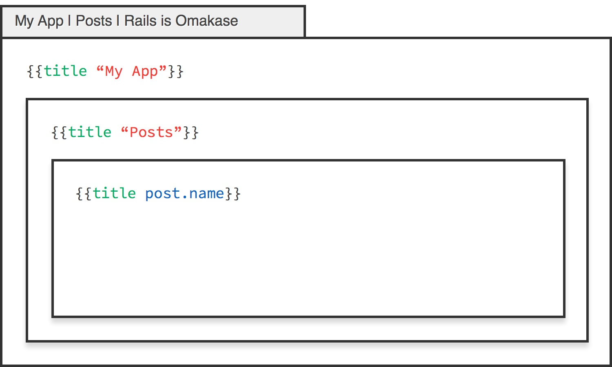
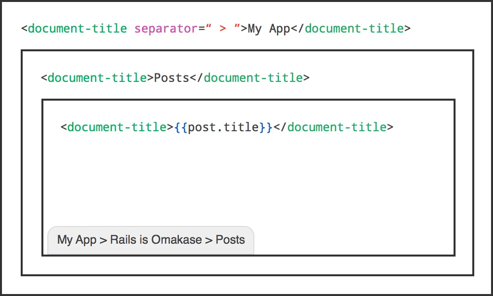
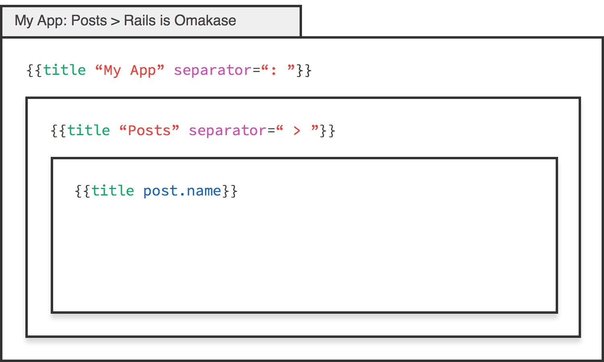
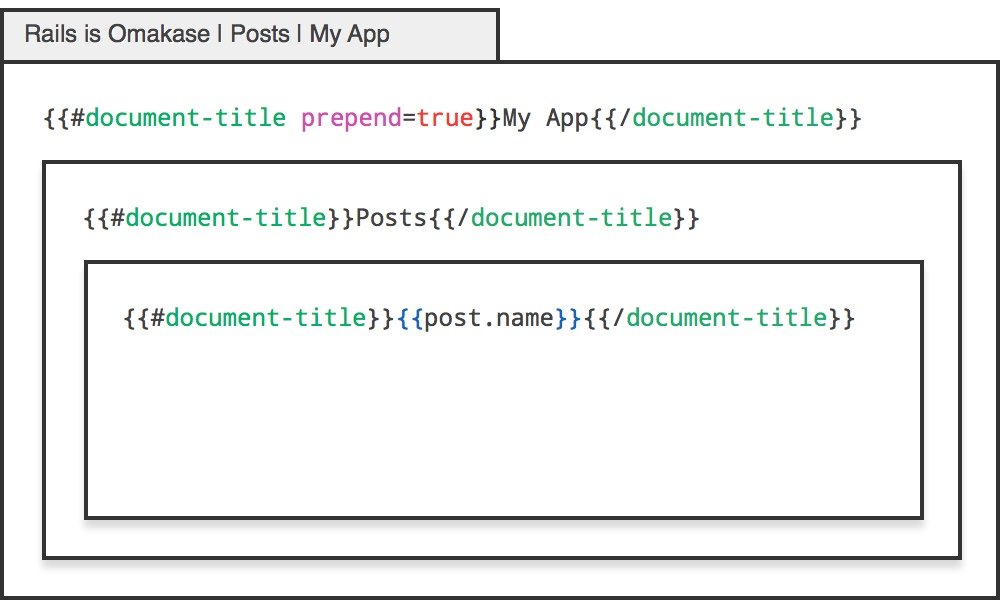
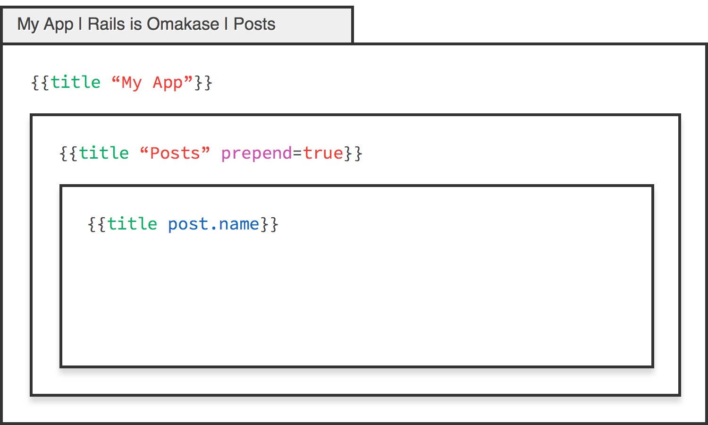
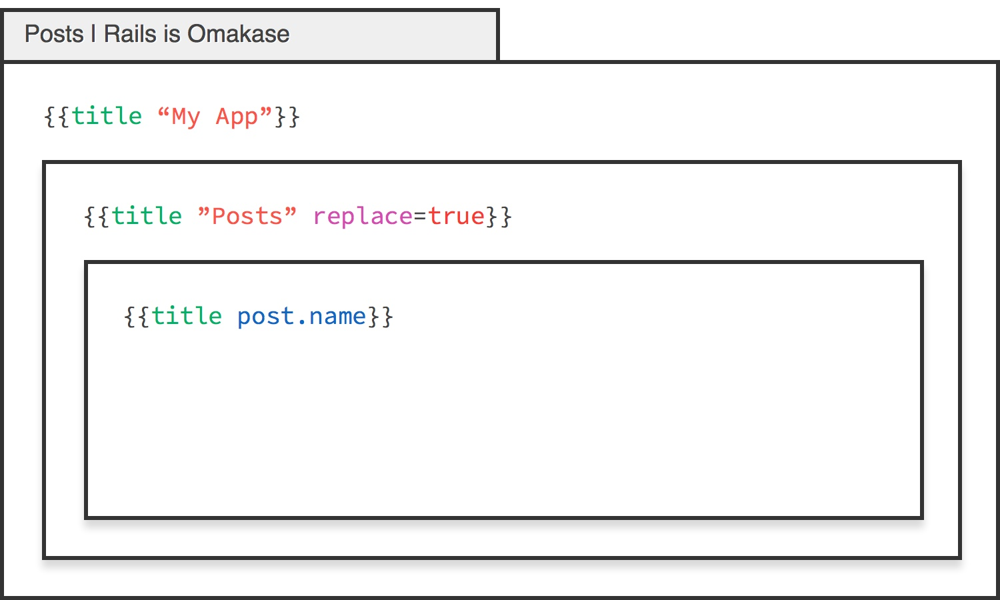
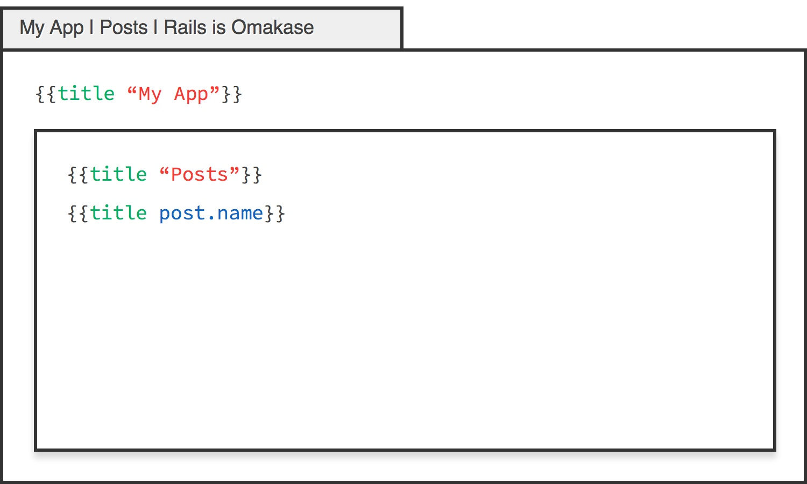
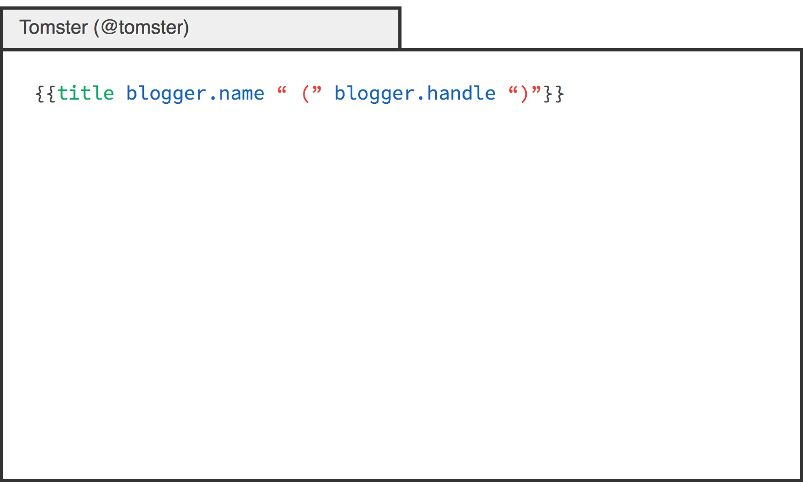

## {{title}} [](http://emberobserver.com/addons/ember-document-title) [](https://travis-ci.org/paddle8/ember-document-title) [](https://codeclimate.com/github/paddle8/ember-document-title)

This addon provides a helper for changing the title of the page you're on.

### Installing via ember-cli

`ember-document-title` follows the release format provided in [The Ember 2.x Project](http://emberjs.com/blog/2015/06/16/ember-project-at-2-0.html). For support of Ember versions below 1.13, please use `1.1.11`:

```bash
ember install ember-document-title@1.1.11
```

For any other app, follow the scheme outlined in the blog post. Previous versions of the addon may work with newer versions of Ember, but that **is not guaranteed**-- YMMV. If you're on the latest stable release of Ember, you may install the addon without a version number.

```bash
ember install ember-document-title
```

### Usage

To start, let's add a root title for your application. This goes in `application.hbs`.

```handlebars
{{title "My App"}}
```

This sets the title for your application. When your application loads, you should see the title `My App` appear.

By default, using the helper will allow an interaction where additional titles are appended to the root:



You can change the separator by specifying the `separator` attribute.



Separators can be changed at arbitrary levels:



Titles can be prepended to the parent, by setting the `prepend` attribute to `true`.



This allows one to swap the order at arbitrary levels:



And for special templates that need to complete control over the title, set the `replace` attribute to `true`. This will only apply for that level.



In addition, there's no limit to the amount of titles you can put in a route:



Dynamic tokens are available by providing multiple parameters to the helper:



### API

| attribute | type    | default |
|-----------|:--------|:--------|
| separator | string  | `" | "` |
| prepend   | boolean | false   |
| replace   | boolean | false   |

The default value for the separator can be overridden by extending the service that stores the list of titles:

```javascript
// app/services/document-title-list.js
import DocumentTitleList from 'ember-document-title/services/document-title-list';

export default DocumentTitleList.extend({
  defaultSeparator: ' > '
});
```
